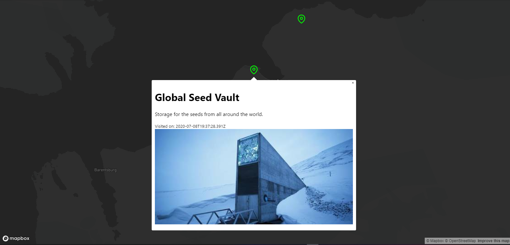

# Travel Log

----
## Why?
I was out of ideas and wanted to learn a few things about maps.

> Please don't judge the code quality lol.

---
## Features
More like progress

- [x] express setup
- [x] mongoose schema
- [x] fetch logs and create log APIs
- [x] react setup
- [x] fetch logs
- [x] show logs on map
- [x] form for adding new log
- [x] documentation 

----
## How to use?
1. You'll need mapbox token. Put it inside client in `.env`.
2. Client: `cd client` and `npm start`.
3. For server you'll need DB URL in `.env`.
4. Server: `cd server` and `npm start`.

----
### Demo

#### Author
[Sanjeev Sharma](https://thesanjeevsharma.now.sh)